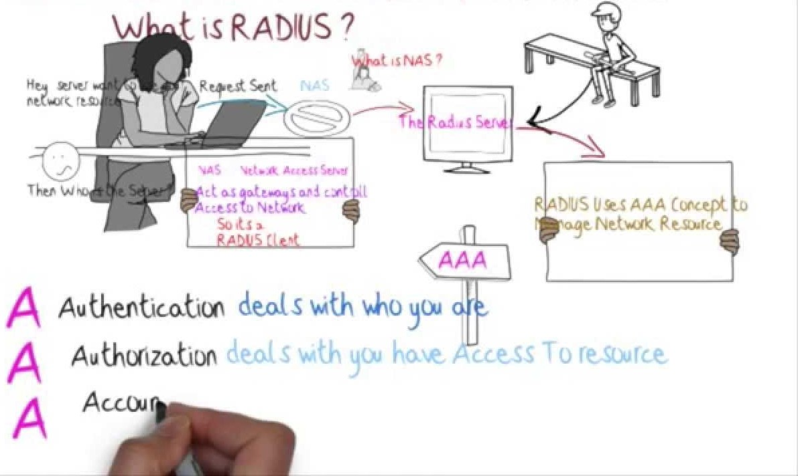

**RADIUS (REMOTE AUTHENTICATION DIAL-IN USER SERVICE)**

  

**LATAR BELAKANG**

Pada pertemuan kali ini dibahas mengenai RADIUS. RADIUS merupakan singkatan dari Remote Authentucation Dial-In User Service. Pada bab pembahasan akan dijelaskan lebih lengkap mengenai RADIUS dan penjelasan lainnya

**PEMBAHASAN**

**Definisi**

Remote Authentication Dial-In Pengguna Service (RADIUS) adalah klien server protokol / dan software yang memungkinkan server akses remote untuk berkomunikasi dengan server pusat untuk mengotentikasi dial-in pengguna dan mengotorisasi akses mereka ke sistem atau layanan yang diminta. RADIUS memungkinkan perusahaan untuk mempertahankan profil pengguna di database pusat bahwa semua server remote dapat berbagi. Ini memberikan keamanan yang lebih baik, memungkinkan perusahaan untuk mengatur kebijakan yang dapat diterapkan pada titik jaringan tunggal diberikan. Dibuat oleh Livingston (sekarang dimiliki oleh Lucent), RADIUS adalah de facto standar industri yang digunakan oleh sejumlah perusahaan produk jaringan dan merupakan standar IETF diusulkan.

RADIUS adalah layanan keamanan untuk otentikasi dan otorisasi pengguna dial-up. Sebuah jaringan perusahaan yang khas mungkin memiliki server akses melekat kolam modem, bersama dengan server RADIUS untuk menyediakan layanan otentikasi. pengguna remote dial ke server akses, dan server akses mengirimkan permintaan otentikasi ke server RADIUS. RADIUS Server mengotentikasi pengguna dan wewenang akses ke sumber daya jaringan internal. pengguna jarak jauh adalah klien ke server akses dan server akses klien ke server RADIUS. RADIUS pada awalnya dikembangkan oleh Livingston Enterprises untuk seri portmaster mereka server akses jaringan. Lucent Technologies membeli Livingston pada Oktober 1997, dan kini mengklaim software itu &quot;diciptakan oleh Access Bisnis Unit Remote dari Lucent Technologies pada tahun 1992.&quot; Sisa dari topik ini mengacu pada deskripsi RADIUS disediakan oleh Lucent. Perhatikan bahwa RADIUS merupakan protokol terbuka dan didistribusikan sebagai kode sumber. Hal ini didefinisikan dalam RFC Internet berikut. Lihat &quot;NAS (Network Access Server)&quot; untuk RFC terkait. RFC 2139 (RADIUS Akuntansi, April 1997) RFC 2865 (Remote Authentication Dial Dalam Pengguna Jasa (RADIUS), Juni 2000) Karena RADIUS terbuka, dapat disesuaikan untuk bekerja dengan produk keamanan pihak ketiga atau sistem keamanan proprietary. Server akses yang mendukung protokol client RADIUS dapat berkomunikasi dengan server RADIUS. RADIUS sering disebut sebagai RADIUS AAA, mengacu pada fungsi otentikasi, otorisasi, dan akuntansi. &quot;Akuntansi&quot; mengacu pada kemampuan RADIUS untuk mengumpulkan informasi tentang sesi pengguna yang dapat diolah untuk penagihan dan analisis jaringan. Sistem otentikasi RADIUS dasar menggunakan database pengguna sendiri, tetapi sumber-sumber informasi pengguna termasuk UNIX file password, Sun NIS (Network Information Service), dan direktori yang dapat diakses melalui LDAP (Lightweight Directory Access Protocol).

**PENUTUP**

1. **Kesimpulan :** RADIUS adalah kepanjangan dari Remote Authentiction Dial-In User Service yang merupakan sebuah aplikasi atau software yang berfungsi sebagai penghubung server akses remote untuk berkomunikasi dengan server pusat.
2. **Saran :** Sebaiknya mencari sumber lain yang lebih mendalam membahas tentang RADIUS ini sendiri

