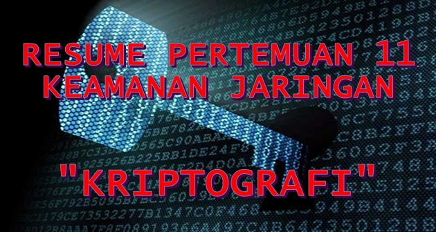

**KRIPTOGRAFI, ENCODE &amp; DECODE, ENKRIPSI &amp; DEKRIPSI, DAN HASHING**

  

**LATAR BELAKANG MASALAH**

Setiap orang memiliki rahasia, dan beberapa memiliki lebih dari yang lain. Ketika menjadi perlu untuk mengirimkan mereka rahasia dari satu titik ke titik lain, penting untuk melindungi informasi sementara itu dalam perjalanan. Kriptografi menyajikan berbagai metode untuk mengambil terbaca, data yang dibaca, dan mengubahnya menjadi data terbaca untuk tujuan transmisi aman, dan kemudian menggunakan kunci untuk mengubahnya kembali menjadi data yang dapat dibaca saat mencapai tujuannya. Pada pembahasan akan dijelaskan secara lengkap tentang kriptografi dan jenis lainnya.

**PEMBAHASAN**

- **Kriptografi**

Kriptografi adalah ilmu untuk menjaga keamanan informasi ketika informasi dikirim dari suatu tempat ke tempat lainnya. Kriptografi berasal dari dua kata Bahasa Yunani yaitu crypto yang artinya rahasia dan graphia yang artinya tulisan.

Kriptografi bertujuan untuk memberikan layanan pada aspek-aspek keamanan yaitu:

- Kerahasiaan, yaitu menjaga supaya pesan tidak dapat dibaca oleh pihak-pihak yang tidak berhak,

- Integritas data, yaitu memberikan jaminan bahwa untuk tiap bagian pesan tidak akan mengalami perubahan dari saat data 10 dibuat/dikirim oleh pengirim sampai dengan saat data tersebut dibuka oleh penerima data.

- Otentikasi, yaitu berhubungan dengan identifikasi, baik mengidentifikasi kebenaran pihak-pihak yang berkomunikasi maupun mengidentifikasi kebenaran sumber pesan,

- Penyangkalan, yaitu memberikan cara untuk membuktikan bahwa suatu dokumen datang dari seseorang tertentu sehingga apabila ada seseorang yang mencoba mengakui memiliki dokumen tersebut, dapat dibuktikan kebenarannya dari pengakuan orang tersebut.

- **Encode dan Decode**

Encode adalah penyandian atau proses untuk mengubah kode asli ke dalam bentuk kode lain agar saat pengeksekusian tidak menggunakan kode asli atau asalnya. Sedangkan Decode adalah mengekstrak data yang telah di encode tadi ke dalam bentuk kode asli atau asalnya. Contoh Encode adalah menkonversi bilangan ASCII ke bilangan heksadesimal. Dan contoh Decode adalah menkonversi bilangan heksadesimal ke bilangan ASCII.

- **Enkripsi dan Deskripsi**

Enkripsi adalah proses merubah data agar tidak terbaca oleh piak yang tidak berhak, dengan menggunakan metode/tehnik kata kunci. Sedangkan Dekripsi adalah proses merubah data yang telah di enkripsi menjadi data yang dapat terbaca, dan hanya mereka yang memiliki password yang benar atau kunci dekripsi yang dapat membuat data dibaca lagi.

- **Hashing**

Hashing adalah hasil enkripsi dari sebuah password atau informasi yang dianggap penting. Hashing digunakan untuk indeks dan mengambil data dalam database karena lebih cepat untuk menemukan data menggunakan kunci hash yang lebih pendek daripada untuk menemukannya menggunakan nilai asli. Hashing juga digunakan dalam banyak algoritma enkripsi.

**PENUTUP**

1. **Kesimpulan** : Kriptografi adalah suatu ilmu yang mempelajari penulisan secara rahasia dengan menggunakan teknik-teknik metematika. Dalam menjaga kerahasiaan data dengan kriptografi, data sederhana yang dikirim dan diubah ke dalam bentuk data sandi, kemudian data sandi tersebut hanya dapat dikembalikan ke  bentuk data sebenarnya hanya dengan menggunakan kunci (key) tertentu yang dimiliki oleh pihak yang sah saja. Jenis Transformasi Data yaitu Encode &amp; Decode, Enkripsi &amp; Deskripsi dan Hashing.
2. **Saran** : Sebaiknya mencari sumber lain yang membahas materin ini lebih mendalam.