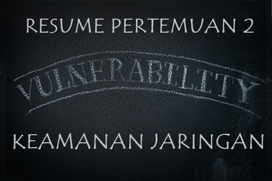

**VULNERABILITIES**

1. LATAR BELAKANG MASALAH

  

Di dalam keamanan jaringan kita harus mengenal betapa pentingnya network security untuk menghindari kecurangan seperti sebuah user memasuki komputer kita dan mendapatkan hak akses untuk mengacau data kompuer kita. Berikut akan dibahas tentang Vulnerability di dalam sistem keamanan jaringan.

1. PEMBAHASAN

Vulnerability adalah suatu kelemahan di dalam sistem. Biasanya disebabkan oleh kelalaian admin atau bisa juga karena kesalahan dalam pengaturan. Sehingga bisa menyebabkan peretas mendapatkan hak akses ke dalam komputer yang dituju.

Dengan adanya suatu kelemahan seperti vulnerability menyebabkan upaya – upaya seperti peretasan, yang sering disebut exploit.

Berikut adalah type type dari vulnerability

1. **Physical** yaitu kelemahan secara fisik contohnya adalah lokasi dari sebuah bangunan
2. **Natural** yaitu kelemahan yang disebabkan oleh linkungan atau alam contohnya masalah listrik, gempa bumi, dan lain lain
3. **Hardware dan Software** yaitu kelemahan yang diebabkan oleh jenis hardware dan software yang rentan
4. **Media** yaitu kelemahan yang disebabkan oleh media penyimpanan seperti cd-rom, flashdisk yang rusak karena kesalahan arus listrik

Kemudian ada istilah ARP Table yang berguna untuk mentransformasikan IP address menjadi MAC Adress. MAC Adress sendiri adalah sebuah jaringan dalam komputer yang berguna untuk menghubungan komunikasi antar jaringan local seperti user dengan Router. Cara menggunakan ARP Table cukup mudah, dengan mengetikkan &quot; **arp-a**&quot; kemudian klik enter.

1. PENUTUP

1. Kesimpulan        : Dalam sistem Keamanan Jaringan sangat disayangkan dengan adanya vulnability karena dapat saja siapapun dapat meretas komputer kita sendiri. Vulnability sendiri juga memiliki beberapa type. Serta ARP table yang membantu untuk mentransformasikan dari IP address ke MAC address.
2. Saran                : Sangat dianjurkan untuk mencari referensi pada situs lain agar lebih menambah wawasan pembaca.

