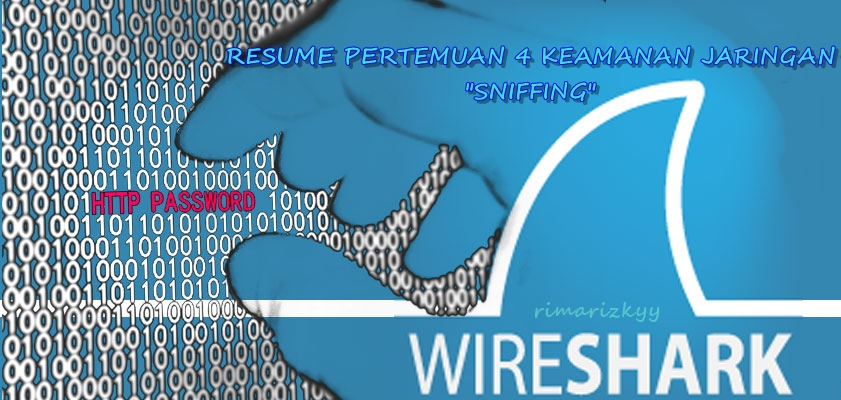

**SNIFFING**

**LATAR BELAKANG MASALAH**

Di dalam dunia jaringan, dikenal dengan istilah sniffing atau penyadapan. Tentu aktivitas ini sangat merugikan bagi para user karena banyak hal negative yang dapat dilakukan oleh aktivitas sniffing ini.

**PEMBAHASAN**

  

Network Sniffing adalah serangkaian aktifitas penyadapan di dalam jaringan dan sangat sulit untuk dicegah. Sniffing termasuk permasalahan yang terjadi di dalam protokol jaringan, jadi sistem operasi tidak ada hubungannya sama sekali. Sniffing biasanya dilakukan oleh administrator jaringan yang bertugas untuk mengatur server atau biasa juga oleh user yang terhubung pada jaringan yang sama.

Sniffing tebagi 2 jenis yaitu:

**Active Sniffing** adalah aktivitas penyadapan yang menyentuh data dan paket dalam jaringan tersebut. Dengan tersentuhnya data dan paket dalam jaringan maka sniffing bisa dilakukan dengan mudah. Umunya, aktivitas jenis ini di lakukan dalam switch. Active Sniffing yang paling sering di gunakan yaitu adalah ARP Poisoning.

**Passive Sniffing** adalah kebalikan dari active sniffing yaitu aktivitas penyadapan dengan tidak menyentuh sama sekali data dan paket dalam jaringan. Biasanya dilakukan di dalam Hub karena cara kerja hub yang bertugas untuk meneruskan signal broadcast ke computer. Biasanya passive sniffing menggunakan aplikasi seperti WireShark.

Biasanya sniffing dilakukan menggunakan sebuah software atau tool khusus sniffer. Contohnya Ethereal, Cain &amp; Abel, DSNIFF, WireShark, dll. Contoh proses sniffing adalah ketika menyadap username dan password dosen yang memiliki akses khusus di dalam sistem kampus. Hal pertama yang harus dipastikan adalah kita harus terhubung dengan jaringan yang sama dengan perangkat dosen. Lalu buka program sniffer seperti yang di sebutkan di atas, maka ketika dosen login program sniffer akan  mencari dan mengambil username dan password yang di gunakan oleh dosen tersebut. Jika berhasil maka username dan password dosen tersebut dapat digunakan oleh kita sendiri.

Sniffing sangat merugikan karena bisa mengakses data pribadi. Sniffing sendiri sangat sulit untuk dicegah namun bisa diminimalisir dengan cara penggunaan  enkripsi data.

**PENUTUP**

**Kesimpulan:** Sniffing adalah aktifitas penyadapan yang sangat merugikan. Sniffing dibagi dua jenis yaitu Active dan Passive Sniffing. Banyak program atau software pendukung aktifitas sniffing dan sniffing sampai saat ini masih sulit dicegah.

**Saran:** Lebih berhati hatilah terhadap aktifitas sniffing ini, sebaiknya menggunakan protokol yang aman dan menggunakan sistem enskripsi data yang lebih aman.

