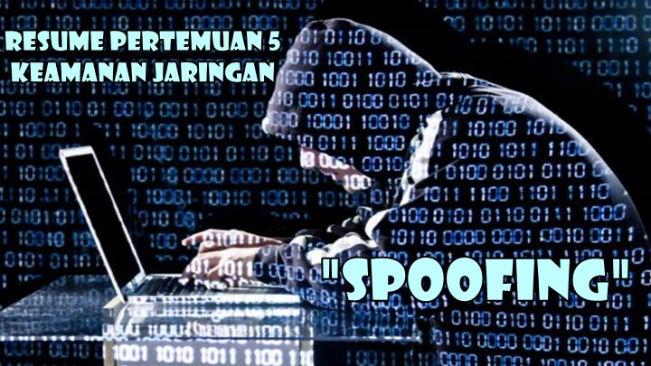
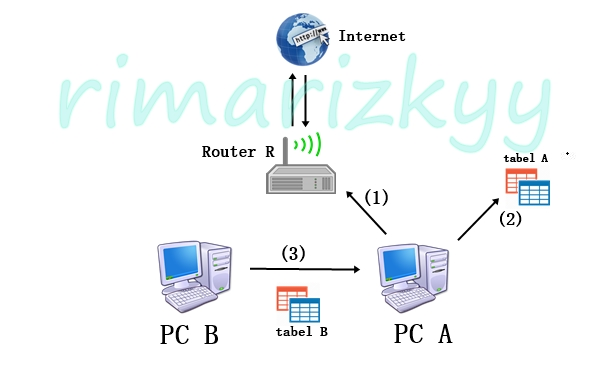

**SPOOFING**

  

**LATAR BELAKANG**

Salah satu teknik dari penyerangan atau peretasan yang termasuk merugikan. Berikut akan dibahas definisi dari spoofing, jenis – jenis spoofing, dan contoh spoofing, serta cara menghindari spoofing.

**PEMBAHASAN**

- --Definisi

Spoofing adalah salah satu dari banyak teknik penyerangan di dalam peretasan dengan cara berpura – pura dengan menjadi host atau memalsukan host itu sendiri untuk mendapatkan akses yang tidak sah ke suatu perangkat komputer.

- --Jenis – Jenis Spoofing

-IP Spoofing

Jenis serangan yang rumit, jenis serangan ini biasanya menggunakan cara dengan seolah – olah komputer tersebut digunakan oleh orang lain. Jadi ini adalah jenis spoofing yang memberikan alamat IP palsu.

-DNS Spoofing

Sementara untuk jenis spoofing ini dengan cara ketika target meminta request alamat domain IP A maka hacker akan mengirim alamat fisik palsu. Alamat IP ini didapat dari sebuah domain.

- --Contoh Spoofing

  

1. Computer A ingin berkomunikasi dengan internet melalui Router R
2. Computer A bisa merujuk ke Router R dengan cara melihat table alamat dirinya
3. Computer B ingin meracuni Computer A agar Computer A tidak sampai internet, dengan cara memberikan table palsu
4. Sehingga Computer A melihat table palsu tersebut dan mengira Computer B adalah router, maka secara otomatis sambungan internet Computer A terputus.

- --Cara Menghindari Spoofing

-Tidak menerima table dari siapapun

-Membuat table sintetis yang tidak bisa diubah atau diupdate

-Memasang filter pada router

-Enkripsi data

-Authentifikasi data

**PENUTUP**

1. **Kesimpulan        :** Spoofing adalah teknik dari salah satu hacking dengan cara memanipulasi dan berpura – pura menjadi host. Spoofing memiliki dua jenis yaitu DNS dan IP spoofing. Sebaiknya tidak menerima sembarang tabel dari siapapun karena bisa saja itu salah satu spoofing.
2. **Saran                :** Disarankan untuk melakukan apa yang sudah di jelaskan pada cara menghindari spoofing. Agar tidak menjadi korban spoofing itu sendiri.

