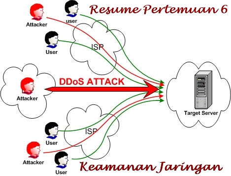

**DENIAL OF SERVICE**

  

**LATAR BELAKANG MASALAH**

Salah satu serangan yang merugikan adalah Denial of Service (DoS) Attack. Serangan yang berbeda dari pencurian data atau penyadapan.  Berikut akan dibahas tentang Denial of Service, lalu cara sistem Denial of Service berjalan, dan cara mencegah dari Denial of Service ini.

**PEMBAHASAN**

Serangan Denial of Sevice adalah serangan terhadap suatu komputer atau sebuah server di dalam jaringan internet. Serangan ini melumpuhkan sistem sehingga sistem tersebut tidak dapat menyediakan service – service jadi service tersebut menjadi turun drastis.

Beberapa cara sistem Denial of Service berjalan yaitu dengan cara:

- Traffic Flooding yaitu membuat lalu lintas jaringan banjir dengan banyak data sehingga korban tidak dapat masuk ke dalam jaringan.
- Request Flooding yaitu membanjiri lalu lintas jaringan yg berada di dalam host dengan banyak request
- Mengubah konfigurasi sistem atau perusakan terhada komponen dari server
- Membuat server sibuk dengan memenuhi batas maksimal jumlah client sehingga server tidak bisa melayani korban

Berikut adalah yang dapat dilakukan untuk mencegah terjadinya Denial of Service, yaitu:

- Membuat Honeypot yang membuat penyerang seolah – olah telah berhasil masuk dan menyadap pc kita.
- Menaikkan kapasitas service dan server juga menaikkan request
- Memasukkan semua IP penyerang
- Memblock IP penyerang dengan firewall

**PEMBAHASAN**

1. **Kesimpulan :** Denial of Service adalah serangan terhadap server tidak bisa melayani korban dan korban tidak bisa menikmati service yang disediakan server. Banyak cara dalam serangan DoS dan banyak juga cara mencegah serangan DoS ini.
2. **Saran :** Selalu hati hati dalam mengakses suatu URL agar terhindar dari Denial of Service ini.

