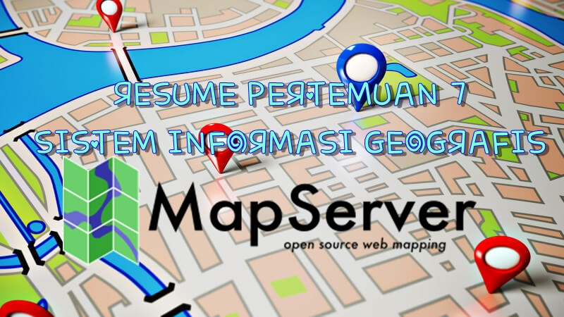

**MAP SERVER**

  

LATAR BELAKANG

Di dalam Sistem Informasi Geografis terdapat aplikasi yang bersifat opensource yang bernama MapServer. Selanjutnya akan dijelaskan lebih dalam mengenai MapServer ini pada bab pembahasan.

PEMBAHASAN

Pengertian MapServer

Merupakan aplikasi yang bersifat opensource yang akan menampilkan dan mengolah data spasial kita di web. Jadi pemetaan GIS di web dibuat oleh aplikasi MapServer ini.

Fitur – Fitur MapServer:

- --Dapat menampilkan data spasial yang berformat seperti Shapefile, PostGIS dan lainnya menggunakan library OGR
- --Dapat menampilan data raster yang berformat TIFF/GeoTIFF, EPPL7 dan lainnya menggunakan library GDAL
- --Mendukung rendering karakter berbagai font
- --Dapat menampilkan peta tematik menggunakan ekspresi logic dan regular
- --Dapat dikembangkan menggunakan keluaran menggunakan template.
- --Dapat menampilkan gambaran elemen peta secara otomatis berupa skala grafis, legenda peta dan juga indeks peta
- --Dapat menampilkan label objek spasial dan dapat diatur juga sehingga tidak tumpeng tindih
- --Dalam menggambarkan objek menggunakan skala
- --Dapat menangani berbagai macam sistem proyeksi secara on the fly.

Cara Install MapServer

- --Jika tidak menggunakan centos maka jalankan melalui Virtual Box.
- --Setelah itu pastikan koneksi jaringan virtual box bisa diakses dari komputer host
- --Buka terminal, login sebagai root
- --Ketikkan &quot;#install mapserver 5
- --Tunggu hingga proses install selesai.

Pengertian MapProxy

Merupakan suatu program yang berfungsi untuk menampung hasil gambar dari MapServer agar konsumsi komputer bisa direduksi

Cara Install MapProxy

- --Ketikkan &quot;#install python-pip dan python-dev&quot;
- --Lalu &quot;#pip install mapproxy&quot;
- --Setelah itu ketikkan &quot;#install Vwsqi&quot;
- --Tunggu hingga proses selesai.

PENUTUP

1. Kesimpulan : MapServer merupakan aplikasi opensource yang bekerja berdampingan dengan MapProxy. Di dalam MapServer terdapat fitur – fitur dan cara menginstall MapServer dan MapProxy cukup mudah.
2. Saran : Disarankan untuk membaca dari referensi lain yang lebih lengkap.

